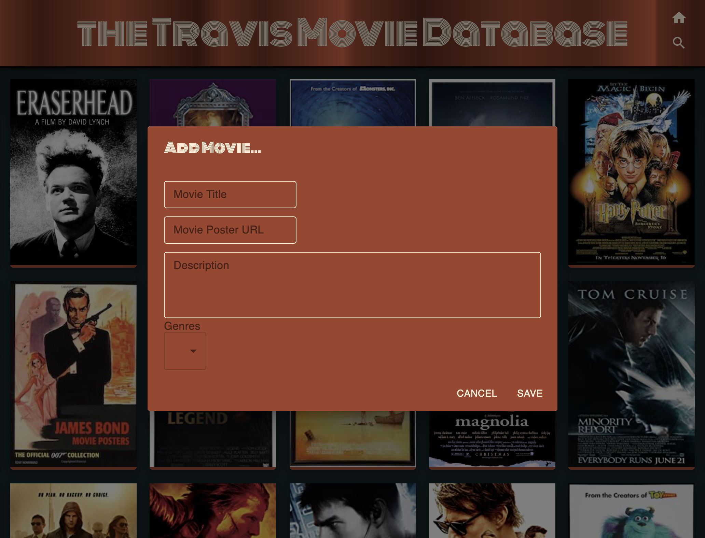
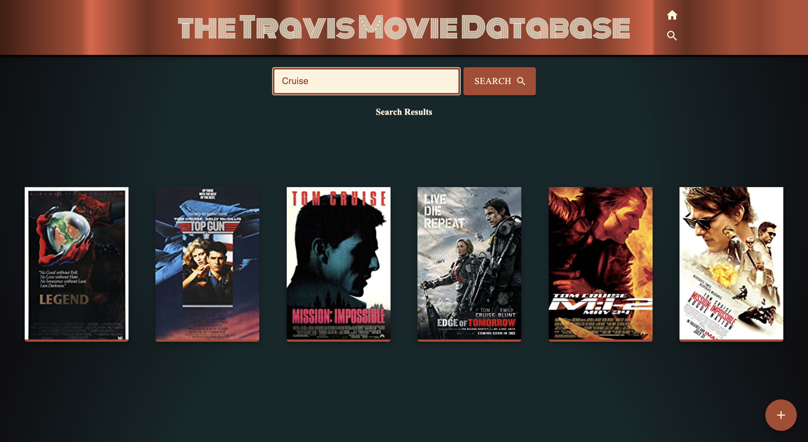

# Project Name

The Travis Movie Database (TMDb)

## Description

_Duration: 48 Hour Sprint_

TMDb is a simple movie organization app built using React, Redux, and Material UI. This assignment from Prime was a great way to work with databases and joining tables. A lot of my time was spent on figuring out the right sql queries for adding and getting data as well as setting up reducers and sagas. 

Building this app also allowed me to get more familiar with Material UI and customizing their built in styles. 

## Screen Shots

### Home Page:

### Add Movie:

### Search

### Prerequisites

Link to software that is required to install the app (e.g. node).

- [Node.js](https://nodejs.org/en/)
- [PostgreSQL](https://www.postgresql.org/)

## Installation

1. Create a database named `saga_movies_weekend`,
2. The queries in the `database.sql` file are set up to create all the necessary tables and populate the needed data to allow the application to run correctly. The project is built on [Postgres](https://www.postgresql.org/download/), so you will need to make sure to have that installed. We recommend using Postico to run those queries as that was used to create the queries, 
3. Open up your editor of choice and run an `npm install`
4. Run `npm run server` in your terminal
5. Run `npm run client` in your terminal
6. The `npm run client` command will open up a new browser tab for you!

## Built With

- React
- Node
- Express
- Material UI
- PostgreSQL
- Redux

## Acknowledgement
Thanks to [Prime Digital Academy](https://www.primeacademy.io) for giving us this fun weekend challenge. 

## Support
If you have suggestions or issues, please email me at [travisjhuss@gmail.com](https://www.gmail.com)

